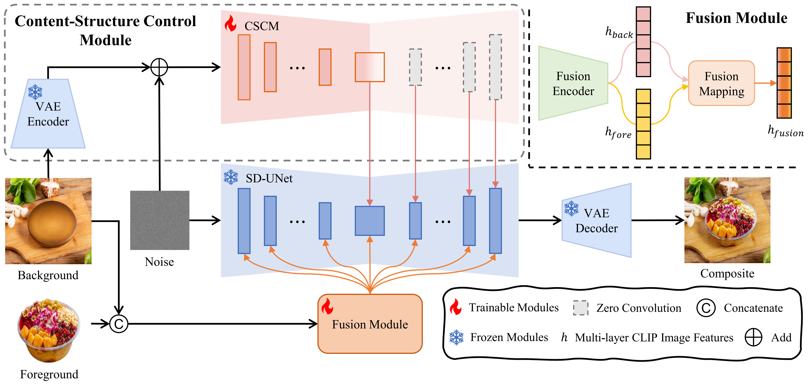

# Foodfusion - Official PyTorch Implementation



This repository provides the discription for the following paper:

**Foodfusion: A Novel Approach for Food Image Composition via Diffusion Models**<br>
Chaohua Shi, Xuan Wang, Si Shi, Xule Wang, [Mingrui Zhu](https://scholar.google.com/citations?user=a8FXS1UAAAAJ&hl=zh-CN&oi=ao), [Nannan Wang](https://scholar.google.com/citations?hl=zh-CN&user=SRBn7oUAAAAJ) and [Xinbo Gao](https://scholar.google.com/citations?user=VZVTOOIAAAAJ&hl=zh-CN&oi=ao)<br>
<br>
> **Abstract:** *Food image composition requires the use of existing dish images and background images to synthesize a natural new image, while diffusion models have made significant advancements in image generation, enabling the construction of end-to-end architectures that yield promising results. However, existing diffusion models face challenges in processing and fusing information from multiple images and lack access to high-quality publicly available datasets, which prevents the application of diffusion models in food image composition. In this paper, we introduce a large-scale, high-quality food image composite dataset, **FC22k**, which comprises 22,000 foreground, background, and ground truth ternary image pairs. Additionally, we propose a novel food image composition method, **Foodfusion**, which leverages the capabilities of the pre-trained diffusion models and incorporates a Fusion Module for processing and integrating foreground and background information. This fused information aligns the foreground features with the background structure by merging the global structural information at the cross-attention layer of the denoising UNet. To further enhance the content and structure of the background, we also integrate a Content-Structure Control Module. Extensive experiments demonstrate the effectiveness and scalability of our proposed method.*


**Dependencies:**

We have tested on:
- CUDA 11.3
- PyTorch 1.11.0
- 64-bit Python 3.8

All dependencies for defining the environment are provided in `environment/Foodfusion_env.yaml`.
We recommend running this repository using [Anaconda](https://docs.anaconda.com/anaconda/install/):
```bash
conda env create -f ./environment/Foodfusion_env.yaml
```
